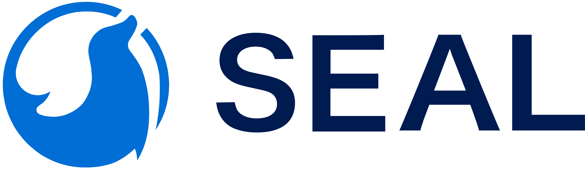

<br>

<p align="center">
    
</p>
<br>

<p align="center">
        English&nbsp | &nbsp<a href="docs/README_CN.md">中文</a>&nbsp
</p>
<br>

Seal is an open-source application management platform that simplifies application deployment and management on any infrastructure. 
It helps platform engineers build golden paths for developers and empowers developers with self-service capabilities.

# Quick Start

```shell
sudo docker run -d --privileged --restart=unless-stopped -p 80:80 -p 443:443 sealio/seal-server
```

Open your browser to `https://<server-ip-or-domain>`

# Documentation

Please see [the official docs site](https://seal-io.github.io/docs/) for complete documentation.

# Community and Support

If you need any help, please join us at
- [Discord](https://discord.gg/fXZUKK2baF)
- [WeChat](docs/WECHAT_CN.md)

Feel free to [file an issue](https://github.com/seal-io/walrus/issues/new) if you have any feedback or questions.

For security issues, please report by sending an email to <security@seal.io>.

# Contributing

Please read our [contributing guide](./docs/CONTRIBUTING.md) if you're interested in contributing to Seal.

# License

Copyright (c) 2023 [Seal, Inc.](https://seal.io)

Licensed under the Apache License, Version 2.0 (the "License");
you may not use this file except in compliance with the License.
You may obtain a copy of the License at [LICENSE](./LICENSE) file for details.

Unless required by applicable law or agreed to in writing, software
distributed under the License is distributed on an "AS IS" BASIS,
WITHOUT WARRANTIES OR CONDITIONS OF ANY KIND, either express or implied.
See the License for the specific language governing permissions and
limitations under the License.
